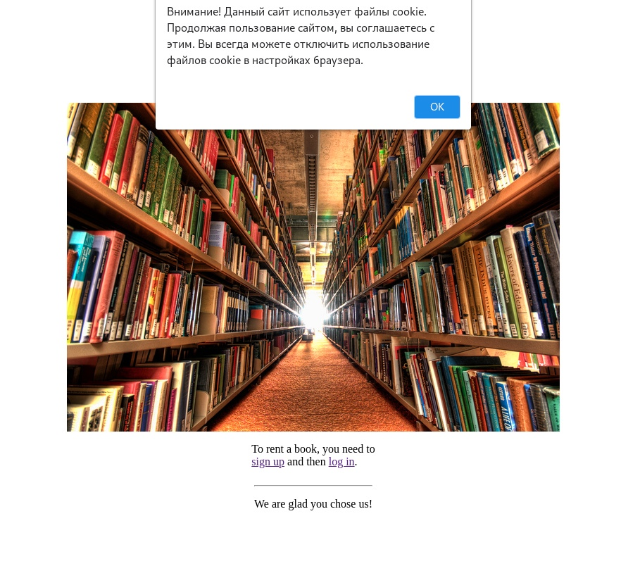
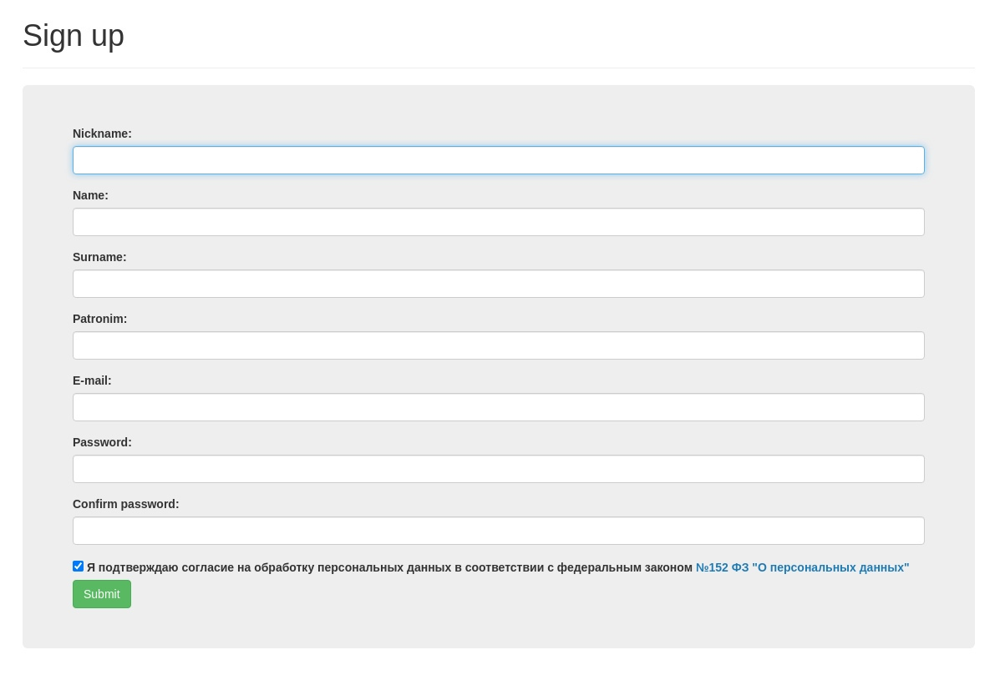
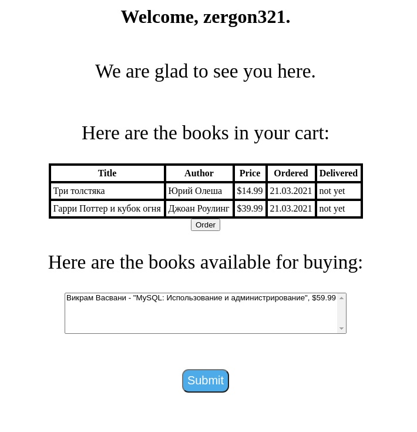
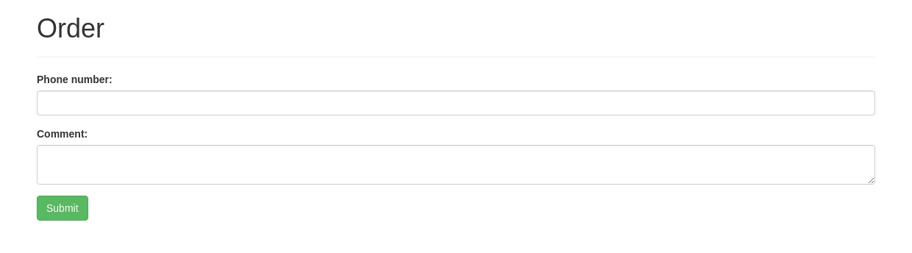

# Книжный магазин

Для запуска необходимо установить язык программирования **Go** и систему управления реляционными базами данных **MySQL**. Затем необходимо создать базу данных. Для этого в **MySQL** необходимо выполнить код из файла `sql/create_db.sql`. Затем нужно в командной строке открыть папку проекта и написать `go mod download` или `go mod tidy`, чтобы скачать все зависимости, необходимые для сборки программы. Запустить веб-приложение можно командой `go run main.go` из командной строки. Веб-приложение будет работать на `127.0.0.1:8080`. Стартовая страница: `127.0.0.1:8080/index`.

Главная страница с сообщением о файлах cookie (`127.0.0.1:8080/index`):

Регистрация пользователя с соглашением на обработку персональных данных (`127.0.0.1:8080/sign-up`):

Страница с каталогом и корзиной, доступная после входа (`127.0.0.1:8080/user`):

Страница оформления заказа (`127.0.0.1:8080/order`):

